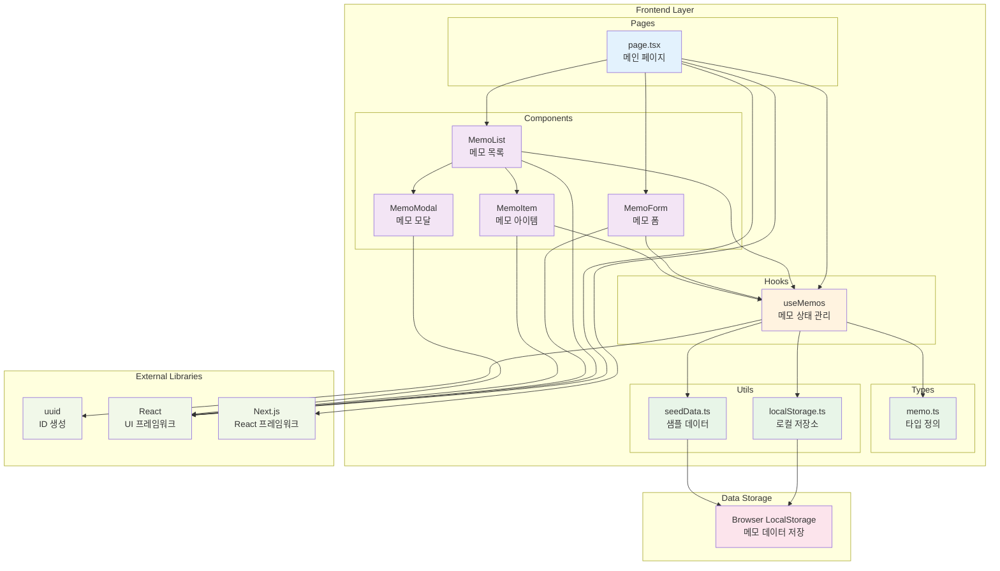
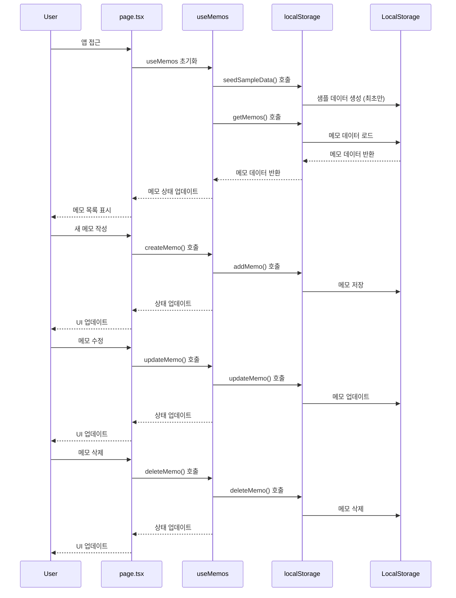
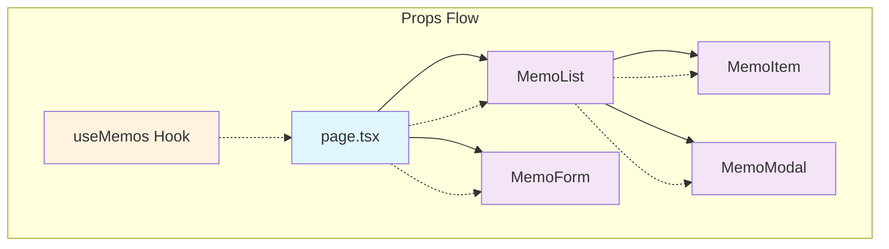

# 메모 앱 시스템 아키텍처

## 개요

이 다이어그램은 Next.js 기반의 메모 관리 애플리케이션의 전체 시스템 아키텍처를 보여줍니다. 클라이언트 사이드 렌더링을 통해 동작하며, 로컬 스토리지를 사용하여 데이터를 저장합니다.

## 시스템 아키텍처 다이어그램

## 데이터 플로우

## 컴포넌트 구조

## 주요 기능

### 1. 메모 관리 (CRUD)
- **생성**: MemoForm을 통한 새 메모 작성
- **조회**: MemoList에서 메모 목록 표시, MemoModal에서 상세 보기
- **수정**: MemoForm을 통한 기존 메모 편집
- **삭제**: MemoItem에서 메모 삭제

### 2. 검색 및 필터링
- 제목, 내용, 태그 기반 검색
- 카테고리별 필터링
- 실시간 검색 결과 업데이트

### 3. 카테고리 시스템
- 개인, 업무, 학습, 아이디어, 기타
- 카테고리별 통계 정보 제공

### 4. 로컬 데이터 저장
- 브라우저 LocalStorage 활용
- 자동 샘플 데이터 생성 (최초 실행 시)

## 기술 스택

- **Frontend**: Next.js 14, React 18, TypeScript
- **Styling**: Tailwind CSS
- **상태 관리**: React Hooks (useState, useEffect, useMemo, useCallback)
- **데이터 저장**: Browser LocalStorage
- **ID 생성**: uuid 라이브러리

## 아키텍처 특징

1. **클라이언트 사이드 앱**: 'use client' 지시어로 CSR 방식 채택
2. **컴포넌트 기반 설계**: 재사용 가능한 작은 컴포넌트들로 구성
3. **커스텀 훅 활용**: useMemos를 통한 상태 및 비즈니스 로직 분리
4. **타입 안전성**: TypeScript를 통한 강타입 시스템
5. **반응형 UI**: Tailwind CSS를 활용한 모바일 친화적 인터페이스
6. **로컬 퍼스트**: 외부 서버 없이 브라우저 로컬 저장소만 활용